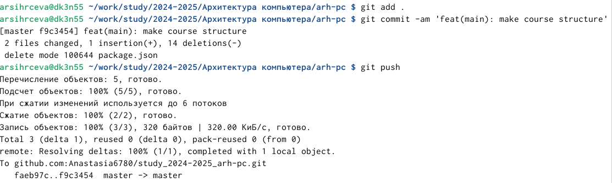

---
## Front matter
title: "Лабораторная работа №2"
subtitle: "Система контроля версий Git"
author: "Сырцева Анастасия Романовна"

## Generic otions
lang: ru-RU
toc-title: "Содержание"

## Bibliography
bibliography: bib/cite.bib
csl: pandoc/csl/gost-r-7-0-5-2008-numeric.csl

## Pdf output format
toc: true # Table of contents
toc-depth: 2
lof: true # List of figures
lot: true # List of tables
fontsize: 12pt
linestretch: 1.5
papersize: a4
documentclass: scrreprt
## I18n polyglossia
polyglossia-lang:
  name: russian
  options:
	- spelling=modern
	- babelshorthands=true
polyglossia-otherlangs:
  name: english
## I18n babel
babel-lang: russian
babel-otherlangs: english
## Fonts
mainfont: IBM Plex Serif
romanfont: IBM Plex Serif
sansfont: IBM Plex Sans
monofont: IBM Plex Mono
mathfont: STIX Two Math
mainfontoptions: Ligatures=Common,Ligatures=TeX,Scale=0.94
romanfontoptions: Ligatures=Common,Ligatures=TeX,Scale=0.94
sansfontoptions: Ligatures=Common,Ligatures=TeX,Scale=MatchLowercase,Scale=0.94
monofontoptions: Scale=MatchLowercase,Scale=0.94,FakeStretch=0.9
mathfontoptions:
## Biblatex
biblatex: true
biblio-style: "gost-numeric"
biblatexoptions:
  - parentracker=true
  - backend=biber
  - hyperref=auto
  - language=auto
  - autolang=other*
  - citestyle=gost-numeric
## Pandoc-crossref LaTeX customization
figureTitle: "Рис."
tableTitle: "Таблица"
listingTitle: "Листинг"
lofTitle: "Список иллюстраций"
lotTitle: "Список таблиц"
lolTitle: "Листинги"
## Misc options
indent: true
header-includes:
  - \usepackage{indentfirst}
  - \usepackage{float} # keep figures where there are in the text
  - \floatplacement{figure}{H} # keep figures where there are in the text
---

# Цель работы

Целью работы является изучить идеологию и применение средств контроля версий. При-
обрести практические навыки по работе с системой git.

# Задание

1. Создать учётную запись на сайте https://github.com
2. Создать предварительную конфигурацию и настроить её
3. Создать SSH ключ
4. Создать рабочее пространство и репозиторий курса
5. Настройка каталога курса
6. Создание и загрузка отчёта

# Теоретическое введение

истема контроля версий Git представляет собой набор программ командной строки.
Доступ к ним можно получить из терминала посредством ввода команды git с различными
опциями.
Благодаря тому, что Git является распределённой системой контроля версий, резервную
копию локального хранилища можно сделать простым копированием или архивацией.

# Выполнение лабораторной работы

Создаю аккаунт на сайте https://github.com/ (рис. [-@fig:001]).

{#fig:001 width=70%}

Делаею предварительную конфигурацию git, настраиваю utf-8 в выводе сообщений, задаю имя начальной ветви и применяю параметры auyocrlf и safecrlf(рис. [-@fig:002]).

{#fig:002 width=70%}

Генерирую SSH ключи (рис. [-@fig:003]).

{#fig:003 width=70%}

Копирую ключ в буфер обмена(рис. [-@fig:004]) и вставляю его в поле на сайте(рис. [-@fig:005])

{#fig:004 width=70%}

.png){#fig:005 width=70%}

Создаю каталог курса по образцу(рис. [-@fig:006]).

{#fig:006 width=70%}

Перехожу по ссылке, указанной в работе(https://github.com/yamadharma/course-directory-student-template), и использую шаблон репозитория и называю его study_2024–2025_arh-
pc(рис. [-@fig:007]).

{#fig:007 width=70%}

Перехожу в каталог курса и клонирую созданный репозиторий(рис. [-@fig:008]).

{#fig:008 width=70%}

Удаляю лишние файлы, создаю необходимые каталоги(рис. [-@fig:009]).

{#fig:009 width=70%}

Отправляю файлы на сервер(рис. [-@fig:010]).

{#fig:010 width=70%}

#Задание для самостоятельной работы

Создаю каталоги для лабораторных работ(рис. [-@fig:011]).

{#fig:011 width=70%}

Переношу отчёты 1 и 2 лабораторных работ в созданные каталоги(рис. [-@fig:011]).

{#fig:011 width=70%}

Загружаю файлы на github(рис. [-@fig:012]).

{#fig:012 width=70%}

При загрузке появляется ошибка(рис. [-@fig:013]), поэтому вручную создаю на сайте каталоги и загружаю в них отчёты(рис. [-@fig:014]).

{#fig:013 width=70%}

{#fig:014 width=70%}

# Выводы

В результате работы приобретены практический навыки по работе с системой git, создан каталог и репозиторий курса.

# Список литературы{.unnumbered}

::: {#refs}
:::
