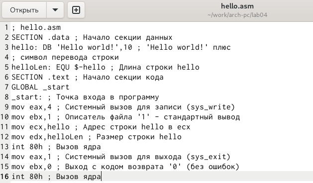
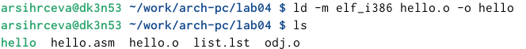

---
## Front matter
title: "Лабораторная работа №4."
subtitle: "Создание и процесс обработки программ на языке ассемблера NASM"
author: "Сырцева Анастасия Романовна"

## Generic otions
lang: ru-RU
toc-title: "Содержание"

## Bibliography
bibliography: bib/cite.bib
csl: pandoc/csl/gost-r-7-0-5-2008-numeric.csl

## Pdf output format
toc: true # Table of contents
toc-depth: 2
lof: true # List of figures
lot: true # List of tables
fontsize: 12pt
linestretch: 1.5
papersize: a4
documentclass: scrreprt
## I18n polyglossia
polyglossia-lang:
  name: russian
  options:
	- spelling=modern
	- babelshorthands=true
polyglossia-otherlangs:
  name: english
## I18n babel
babel-lang: russian
babel-otherlangs: english
## Fonts
mainfont: IBM Plex Serif
romanfont: IBM Plex Serif
sansfont: IBM Plex Sans
monofont: IBM Plex Mono
mathfont: STIX Two Math
mainfontoptions: Ligatures=Common,Ligatures=TeX,Scale=0.94
romanfontoptions: Ligatures=Common,Ligatures=TeX,Scale=0.94
sansfontoptions: Ligatures=Common,Ligatures=TeX,Scale=MatchLowercase,Scale=0.94
monofontoptions: Scale=MatchLowercase,Scale=0.94,FakeStretch=0.9
mathfontoptions:
## Biblatex
biblatex: true
biblio-style: "gost-numeric"
biblatexoptions:
  - parentracker=true
  - backend=biber
  - hyperref=auto
  - language=auto
  - autolang=other*
  - citestyle=gost-numeric
## Pandoc-crossref LaTeX customization
figureTitle: "Рис."
tableTitle: "Таблица"
listingTitle: "Листинг"
lofTitle: "Список иллюстраций"
lotTitle: "Список таблиц"
lolTitle: "Листинги"
## Misc options
indent: true
header-includes:
  - \usepackage{indentfirst}
  - \usepackage{float} # keep figures where there are in the text
  - \floatplacement{figure}{H} # keep figures where there are in the text
---

# Цель работы

Освоение процедуры компиляции и сборки программ, написанных на ассемблере NASM.

# Задание

Здесь приводится описание задания в соответствии с рекомендациями
методического пособия и выданным вариантом.

# Теоретическое введение

Язык ассемблера (assembly language, сокращённо asm) — машинно-ориентированный язык низкого уровня. Можно считать, что он больше любых других языков приближен к архитектуре ЭВМ и её аппаратным возможностям, что позволяет получить к ним более полный доступ, нежели в языках высокого уровня, таких как C/C++, Perl, Python и пр.
Следует отметить, что процессор понимает не команды ассемблера, а последовательности из нулей и единиц — машинные коды.Преобразование или трансляция команд с языка ассемблера в исполняемый машинный код осуществляется специальной программой транслятором — Ассемблер.
Процесс создания ассемблерной программы можно изобразить в виде следующей схемы (рис. [-@fig:000]).

{#fig:000 width=70%}

В процессе создания ассемблерной программы можно выделить четыре шага:
- *Набор текста* программы в текстовом редакторе и сохранение её в отдельном файле. Каждый файл имеет свой тип (или расширение), который определяет назначение файла. Файлы с исходным текстом программ на языке ассемблера имеют тип asm.
- *Трансляция* — преобразование с помощью транслятора, например nasm, текста программы в машинный код, называемый объектным. На данном этапе также может быть получен листинг программы, содержащий кроме текста программы различную дополнительную информацию, созданную транслятором. Тип объектного файла — o, файла листинга — lst.
- *Компоновка или линковка* — этап обработки объектного кода компоновщиком (ld), который принимает на вход объектные файлы и собирает по ним исполняемый файл. Исполняемый файл обычно не имеет расширения. Кроме того, можно получить файл карты загрузки программы в ОЗУ, имеющий расширение map.
- *Запуск программы*. Конечной целью является работоспособный исполняемый файл. Ошибки на предыдущих этапах могут привести к некорректной работе программы, поэтому может присутствовать этап отладки программы при помощи специальной программы — отладчика. При нахождении ошибки необходимо провести коррекцию программы, начиная с первого шага.
Из-за специфики программирования, а также по традиции для создания программ на языке ассемблера обычно пользуются утилитами командной строки (хотя поддержка ассемблера есть в некоторых универсальных интегрированных средах).

# Выполнение лабораторной работы

Создаю рабочий каталог и перехожу в него (рис. [-@fig:001]).

{#fig:001 width=70%}

Создаю текстовый файл с именем hello.asm и открываю его в текстовом редакторе gedit (рис. [-@fig:002]).

{#fig:002 width=70%}

Ввожу в файл текст указанный в условии лабораторной работы (рис. [-@fig:003]).

{#fig:003 width=70%}

Компилирую приведённый выше текст и проверяем наличие файла hello.o, в который запишется объектный код (рис. [-@fig:004]).

{#fig:004 width=70%}

Компилирую исходный файл в odj.o и создаю файл листинга (рис. [-@fig:005]).

{#fig:005 width=70%}

Проверяю наличие нужных файлов (рис. [-@fig:006]).

{#fig:006 width=70%}

Передаю объектный файл на обработку компановщику для получения исполняеймой программы (рис. [-@fig:007]).

{#fig:007 width=70%}

Выполняю команду, указанную в задании (рис. [-@fig:008]).

{#fig:008 width=70%}

Исполняемы файл будет называться main, а объектный файл - obj.o
Запускаю исполняемый файл hello (рис. [-@fig:009]).

{#fig:009 width=70%}

# Самостоятельная работа

Копирую файл hello.asm в рабочий каталог, меняя название на lab4.asm (рис. [-@fig:010]).

{#fig:010 width=70%}

Открываю текстовый редактор gedit (рис. [-@fig:011]).

{#fig:011 width=70%}

В открывшемся редакторе вношу изменения в скопированный файл таким образом, чтобы выводилась строка с моим именем и фамилией (рис. [-@fig:012]).

{#fig:012 width=70%}

Транслирую текст программы в объектный файл и проверяю правильность выполнения (рис. [-@fig:013]).

{#fig:013 width=70%}

Компаную объектный файл (рис. [-@fig:014]).

{#fig:014 width=70%}

Запускаю исполняемого файла (рис. [-@fig:015]).

{#fig:015 width=70%}

Копирую  файлы hello.asm и lab4.asm в свой локальный репозиторий(https://github.com/Anastasia6780/study_2024-2025_arh-pc.git) и загружаю написанный отчёт.

# Выводы

Освоены процедуры компиляции и сборки программ, написанных на ассемблере NASM. Написана программа "Hello world!" и программа, выводящая имя и фамилию.

# Список литературы{.unnumbered}

::: {#refs}
:::
