---
## Front matter
title: "Лабораторная работа №5"
subtitle: "Основы работы с Midnight Commander (mc). Структура программы на языке ассемблера NASM. Системные вызовы в ОС GNU Linux"
author: "Анастасия Романовна Сырцева"

## Generic otions
lang: ru-RU
toc-title: "Содержание"

## Bibliography
bibliography: bib/cite.bib
csl: pandoc/csl/gost-r-7-0-5-2008-numeric.csl

## Pdf output format
toc: true # Table of contents
toc-depth: 2
lof: true # List of figures
lot: true # List of tables
fontsize: 12pt
linestretch: 1.5
papersize: a4
documentclass: scrreprt
## I18n polyglossia
polyglossia-lang:
  name: russian
  options:
	- spelling=modern
	- babelshorthands=true
polyglossia-otherlangs:
  name: english
## I18n babel
babel-lang: russian
babel-otherlangs: english
## Fonts
mainfont: IBM Plex Serif
romanfont: IBM Plex Serif
sansfont: IBM Plex Sans
monofont: IBM Plex Mono
mathfont: STIX Two Math
mainfontoptions: Ligatures=Common,Ligatures=TeX,Scale=0.94
romanfontoptions: Ligatures=Common,Ligatures=TeX,Scale=0.94
sansfontoptions: Ligatures=Common,Ligatures=TeX,Scale=MatchLowercase,Scale=0.94
monofontoptions: Scale=MatchLowercase,Scale=0.94,FakeStretch=0.9
mathfontoptions:
## Biblatex
biblatex: true
biblio-style: "gost-numeric"
biblatexoptions:
  - parentracker=true
  - backend=biber
  - hyperref=auto
  - language=auto
  - autolang=other*
  - citestyle=gost-numeric
## Pandoc-crossref LaTeX customization
figureTitle: "Рис."
tableTitle: "Таблица"
listingTitle: "Листинг"
lofTitle: "Список иллюстраций"
lotTitle: "Список таблиц"
lolTitle: "Листинги"
## Misc options
indent: true
header-includes:
  - \usepackage{indentfirst}
  - \usepackage{float} # keep figures where there are in the text
  - \floatplacement{figure}{H} # keep figures where there are in the text
---

# Цель работы

Целю работы является приобретение практических навыков работы в Midnight Commander, освоение инструкций языка ассемблера mov и int.

# Задание

Здесь приводится описание задания в соответствии с рекомендациями
методического пособия и выданным вариантом.

# Теоретическое введение

Midnight Commander (или просто mc) — это программа, которая позволяет просматривать структуру каталогов и выполнять основные операции по управлению файловой системой, т.е. mc является файловым менеджером. Midnight Commander позволяет сделать работу с файлами более удобной и наглядной.
В Midnight Commander используются функциональные клавиши F1 — F10, к которым привязаны часто выполняемые операции.

| Функциональные клавиши | Выполняемое действие                                                                                                        |
|--------------|----------------------------------------------------------------------------------------------------------------------------|
| `F1`          | Вызов контекстно-зависимой подсказки                                                                              |
| `F2`      | Вызов меню, созданного пользователем   |
| `F3`       | Просмотр файла, на который указывает подсветка в активной панели                                       |
| `F4`      | Вызов встроенного редактора для файла, на который указывает подсветка в активной панели|
| `F5`     | Копирование файла или группы отмеченных файлов из каталога, отображаемого в активной панели, в каталог, отображаемый на второй панели                                                                |
| `F6`      | Перенос файла или группы отмеченных файлов из каталога, отображаемого
в активной панели, в каталог, отображаемый на второй панели                                                               |
| `F7`       | Создание подкаталога в каталоге, отображаемом в активной панели                                                               |
| `F8`       | Удаление файла (подкаталога) или группы отмеченных файлов                                                          |
| `F9`       |   Вызов основного меню программы                                                          |
| `F10`       |  Выход из программы                                                              |

Программа на языке ассемблера NASM, как правило, состоит из трёх секций: секция кода программы (SECTION .text), секция инициированных (известных во время компиляции) данных (SECTION .data) и секция неинициализированных данных (тех, под которые во время компиляции только отводится память, а значение присваивается в ходе выполнения программы) (SECTION .bss).
Для объявления инициированных данных в секции .data используются директивы DB, DW, DD, DQ и DT, которые резервируют память и указывают, какие значения должны храниться в этой памяти:
- DB (define byte) — определяет переменную размером в 1 байт;
- DW (define word) — определяет переменную размеров в 2 байта (слово);
- DD (define double word) — определяет переменную размером в 4 байта (двойное слово);
- DQ (define quad word) — определяет переменную размером в 8 байт (учетверённое слово);
- DT (define ten bytes) — определяет переменную размером в 10 байт
Директивы используются для объявления простых переменных и для объявления массивов. Для определения строк принято использовать директиву DB в связи с особенностями хранения данных в оперативной памяти.
Для объявления неинициированных данных в секции .bss используются директивы resb, resw, resd и другие, которые сообщают ассемблеру, что необходимо зарезервировать заданное количество ячеек памяти. 

# Выполнение лабораторной работы

Открываю Midnight Commander с помощью команды mc (рис. [-@fig:001]), (рис. [-@fig:002]).

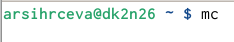{#fig:001 width=70%}

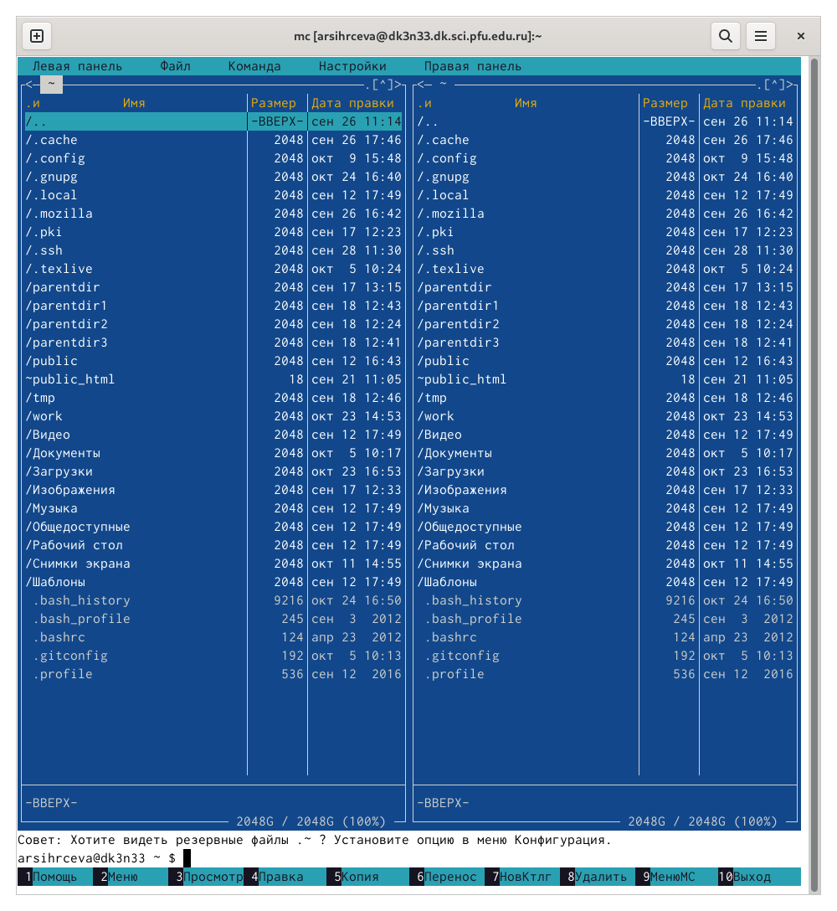{#fig:002 width=70%}

Перехожу в каталог ~/work/arch-pc, созданный в 4 лабораторной работе (рис. [-@fig:003]).

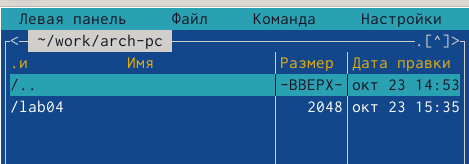{#fig:003 width=70%}

Создаю каталог lab05 и перехожу в него (рис. [-@fig:004]).

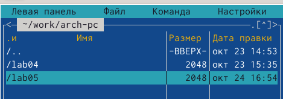{#fig:004 width=70%}

Создаю файл lab5-1.asm (рис. [-@fig:005]).

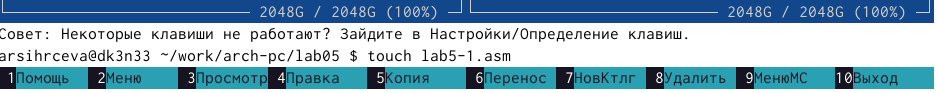{#fig:005 width=70%}

Открываю файл lab5-1.asm для редактирования и ввожу текст программы, указанный в условии лабораторной работы (рис. [-@fig:006]).

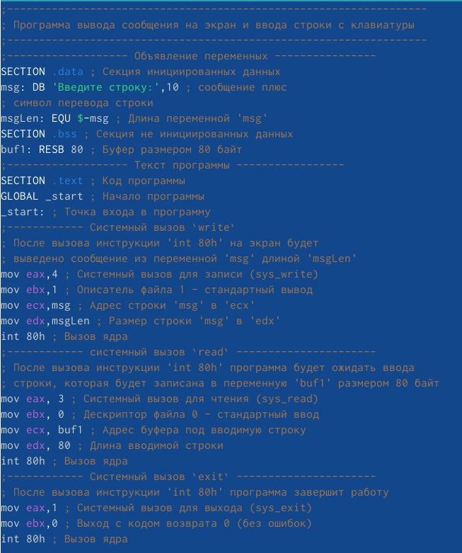{#fig:006 width=70%}

Закрываю файл и открываю его для просмотра, чтобы убедиться в наличии текста программы в нём (рис. [-@fig:007]).

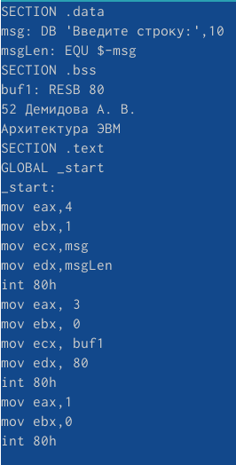{#fig:007 width=70%}

Транслирую текст программы lab5-1.asm в объектный файл,убеждаюсь в правильности выполнения команды и выполняю компановку. [-@fig:008]).

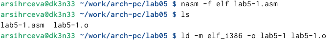{#fig:008 width=70%}

Запускаю получившийся исполняемый файл. На запрос команды ввожу своё ФИО. (рис. [-@fig:009]).

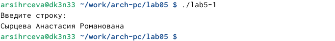{#fig:009 width=70%}

Скачиваю файл in_out.asm из ТУИС(рис. [-@fig:10]).

{#fig:010 width=70%}

Открываю в двух панелях каталог с файлом lab5-1.asm и католог со скачанным файлом in_out.asm (рис. [-@fig:011]).

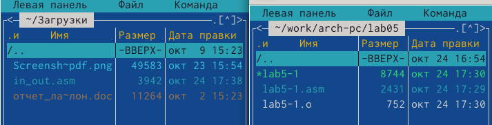{#fig:011 width=70%}

Копирую файл in_out.asm с помощью функциональной клавиши F5 (рис. [-@fig:012]).

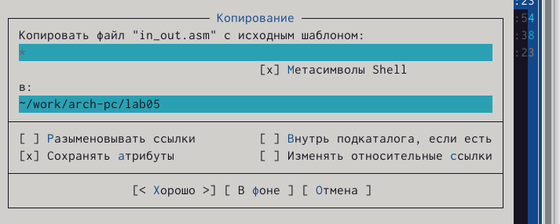{#fig:012 width=70%}

Убеждаюсь в правильности выполненных действий(рис. [-@fig:013]).

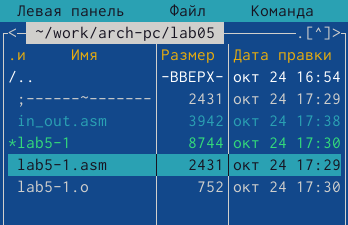{#fig:013 width=70%}

Копирую файл lab5-1.asm изменив имя на lab5-2.asm (рис. [-@fig:014]).

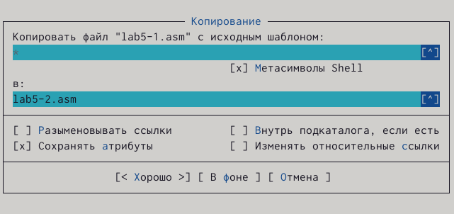{#fig:014 width=70%}

Меняю текст программы в файле lab5-1.asm, используя подпрограммы из внешнего файла in_out.asm(рис. [-@fig:015]).

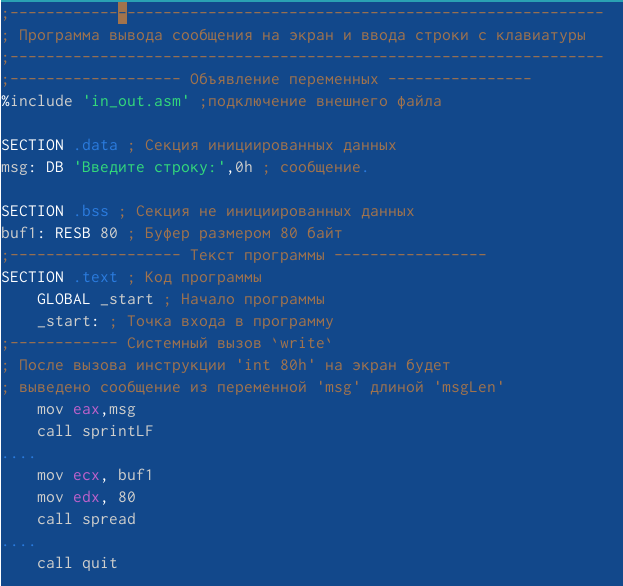{#fig:015 width=70%}

Транслирую объектный файл, компилирую его и запускаю исполняемый файл. На запрос команды ввожу своё ФИО (рис. [-@fig:016]).

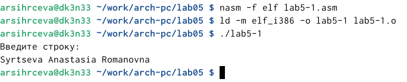{#fig:016 width=70%}

В данном файле  заменяю в тексте программы sprintLF на sprint. Выполняю нужные действия для запуска программы (рис. [-@fig:017]).

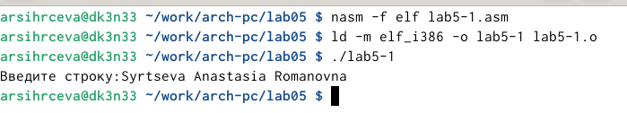{#fig:017 width=70%}

В первом случае ввод ответа происходит на следующей после запроса строки, во втором случае - на той же строке, что и запрос.

#Самостоятельная работа

Копирую файл lab5-2.asm (рис. [-@fig:018]).

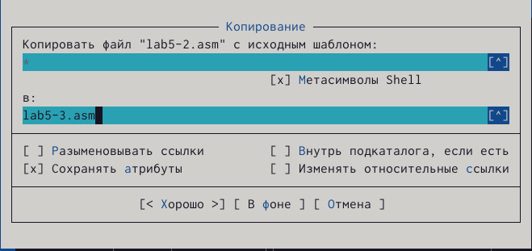{#fig:018 width=70%}

Изменяю текст программы в скопированном файле так, чтобы послле ввода ответа на запрос выводился введённый ответ(рис. [-@fig:019]).

{#fig:019 width=70%}

Транслирую программу в объектный файл, компилирую и запускаю. Ввожу свою фамилию на запрос команды. (рис. [-@fig:020]).

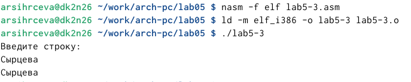{#fig:020 width=70%}

Программа работает верно и после моего ответа ввыдится введённая фамилия.
Копирую файл lab5-1.asm (рис. [-@fig:021]).

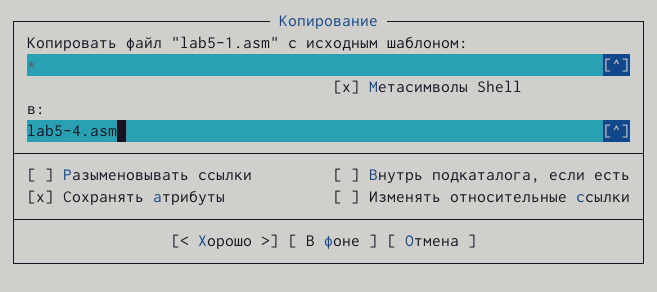{#fig:021 width=70%}

Открываю скопированный файл и изменяю его код для получения того же результата, что и на прошлом шаге (рис. [-@fig:022]).

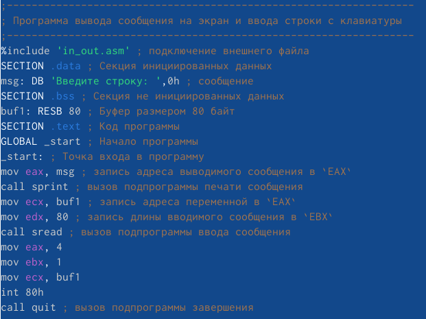{#fig:022 width=70%}

Ввожу необходимые для запуска программы команды. Ввожу свою фамилию на запрос. (рис. [-@fig:023]).

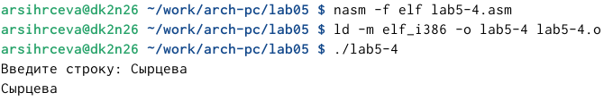{#fig:023 width=70%}

Код работает верно. После ввода ответа выводится введённая строка.

# Выводы

Получены навыки работы в Midnight Commander и освоены инструкции языка ассемблера mov и int.
