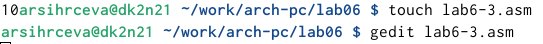

---
## Front matter
title: "Лабораторная работа №6"
subtitle: "Арифметические операции NASM"
author: "Сырцева Анастасия Романовна"

## Generic otions
lang: ru-RU
toc-title: "Содержание"

## Bibliography
bibliography: bib/cite.bib
csl: pandoc/csl/gost-r-7-0-5-2008-numeric.csl

## Pdf output format
toc: true # Table of contents
toc-depth: 2
lof: true # List of figures
lot: true # List of tables
fontsize: 12pt
linestretch: 1.5
papersize: a4
documentclass: scrreprt
## I18n polyglossia
polyglossia-lang:
  name: russian
  options:
	- spelling=modern
	- babelshorthands=true
polyglossia-otherlangs:
  name: english
## I18n babel
babel-lang: russian
babel-otherlangs: english
## Fonts
mainfont: IBM Plex Serif
romanfont: IBM Plex Serif
sansfont: IBM Plex Sans
monofont: IBM Plex Mono
mathfont: STIX Two Math
mainfontoptions: Ligatures=Common,Ligatures=TeX,Scale=0.94
romanfontoptions: Ligatures=Common,Ligatures=TeX,Scale=0.94
sansfontoptions: Ligatures=Common,Ligatures=TeX,Scale=MatchLowercase,Scale=0.94
monofontoptions: Scale=MatchLowercase,Scale=0.94,FakeStretch=0.9
mathfontoptions:
## Biblatex
biblatex: true
biblio-style: "gost-numeric"
biblatexoptions:
  - parentracker=true
  - backend=biber
  - hyperref=auto
  - language=auto
  - autolang=other*
  - citestyle=gost-numeric
## Pandoc-crossref LaTeX customization
figureTitle: "Рис."
tableTitle: "Таблица"
listingTitle: "Листинг"
lofTitle: "Список иллюстраций"
lotTitle: "Список таблиц"
lolTitle: "Листинги"
## Misc options
indent: true
header-includes:
  - \usepackage{indentfirst}
  - \usepackage{float} # keep figures where there are in the text
  - \floatplacement{figure}{H} # keep figures where there are in the text
---

# Цель работы

Освоение арифметических инструкций языка ассемблера NASM.

# Теоретическое введение

## Адресация в NASM

Большинство инструкций на языке ассемблера требуют обработки операндов. Адрес операнда предоставляет место, где хранятся данные, подлежащие обработке. Это могут быть данные хранящиеся в регистре или в ячейке памяти. Далее рассмотрены все существующие способы задания адреса хранения операндов – способы адресации. Существует три основных способа адресации:
- Регистровая адресация – операнды хранятся в регистрах и в команде используются имена этих регистров, например: mov ax,bx.
- Непосредственная адресация – значение операнда задается непосредственно в команде, Например: mov ax,2.
- Адресация памяти – операнд задает адрес в памяти. В команде указывается символическое обозначение ячейки памяти, над содержимым которой требуется выполнить операцию

## Целочисленное сложение add

Схема команды целочисленного сложения add (от англ. addition - добавление) выполняет сложение двух операндов и записывает результат по адресу первого операнда. Команда add работает как с числами со знаком, так и без знака.
Допустимые сочетания операндов для команды add аналогичны сочетаниям операндовдля команды mov.
Так, например, команда add eax,ebx прибавит значение из регистра eax к значению из регистра ebx и запишет результат в регистр eax. 

## Целовисленное вычитание sub

Команда целочисленного вычитания sub (от англ. subtraction – вычитание) работает аналогично команде add и выглядит следующим образом:(рис. [-@fig:000]).

{#fig:000 width=70%}

## Команды инкремента и декремента

При написании программ встречается операция прибавления или вычитания единицы. Прибавление единицы называется инкрементом, а вычитание — декрементом. Для этих операций существуют специальные команды: inc (от англ. increment) и dec (от англ. decrement), которые увеличивают и уменьшают на 1 свой операнд.
Операндом может быть регистр или ячейка памяти любого размера. Команды инкремента и декремента выгодны тем, что они занимают меньше места, чем соответствующие команды сложения и вычитания.

## Команда изменения знака операнда neg

Еще одна команда, которую можно отнести к арифметическим командам это команда изменения знака neg. Она  рассматривает свой операнд как число со знаком и меняет знак операнда на противоположный. Операндом может быть регистр или ячейка памяти любого размера.

## Команды умножения mul и imul

Умножение и деление, в отличии от сложения и вычитания, для знаковых и беззнаковых чисел производиться по-разному, поэтому существуют различные команды.
Для беззнакового умножения используется команда mul (от англ. multiply – умножение), а для знакового умножения используется команда imul.
Для команд умножения один из сомножителей указывается в команде и должен находиться в регистре или в памяти, но не может быть непосредственным операндом. Второй сомножитель в команде явно не указывается и должен находиться в регистре EAX,AX или AL, а результат помещается в регистры EDX:EAX, DX:AX или AX, в зависимости от размера операнда.[-@tbl:6.1]

: Регистры, используемые командами умножения Nasm {#tbl:6.1}

| Размер операнда | Неявный множитель | Результат умножения                                                                                                          |
|--------------|-----------------------|----------------------------------------|
| 1 байт         | AL|    AX                                                                           |
| 2 байта      |  AX  |  DX:AX  |
| 4 байта       |  EAX  |           ADX:EAX                       |

## Команды деления div и idiv

Для деления, как и для умножения, существует 2 команды div (от англ. divide - деление) и idiv. В командах указывается только один операнд – делитель, который может быть регистром или ячейкой памяти, но не может быть непосредственным операндом. Местоположение делимого и результата для команд деления зависит от размера делителя. Кроме того, так как в результате деления получается два числа – частное и остаток, то эти числа помещаются в определённые регистры. [-@tbl:6.2]

: Регистры, используемые командами деления Nasm {#tbl:6.2}

| Размер операнда(делителя) | Делимое | Частное |Остаток                                                                           |
|--------------|------------------------------|----------------------|-------------|
| 1 байт         | AX|    AL | AH                                                                           |
| 2 байта      |  DX:AX  |  AX  | DX |
| 4 байта       |  EDX:EAX  |           EAX         | EDX              |

## Перевод символа числа в десятичную символьную запись

Ввод информации с клавиатуры и вывод её на экран осуществляется в символьном виде.Кодирование этой информации производится согласно кодовой таблице символов ASCII. ASCII – сокращение от American Standard Code for Information Interchange (Американский стандартный код для обмена информацией). Согласно стандарту ASCII каждый символ кодируется одним байтом.
Расширенная таблица ASCII состоит из двух частей. Первая (символы с кодами 0-127) является универсальной (см. Приложение.), а вторая (коды 128-255) предназначена для специальных символов и букв национальных алфавитов и на компьютерах разных типов может меняться.
Среди инструкций NASM нет такой, которая выводит числа (не в символьном виде). Поэтому, например, чтобы вывести число, надо предварительно преобразовать его цифры в ASCII-коды этих цифр и выводить на экран эти коды, а не само число. Если же выводить число на экран непосредственно, то экран воспримет его не как число, а как последовательность ASCII-символов – каждый байт числа будет воспринят как один ASCII-символ – и выведет на экран эти символы.
Аналогичная ситуация происходит и при вводе данных с клавиатуры. Введенные данные будут представлять собой символы, что сделает невозможным получение корректного результата при выполнении над ними арифметических операций.
Для решения этой проблемы необходимо проводить преобразование ASCII символов в числа и обратно.
Для выполнения лабораторных работ в файле in_out.asm реализованы подпрограммы для преобразования ASCII символов в числа и обратно. Это:
- iprint – вывод на экран чисел в формате ASCII, перед вызовом iprint в регистр eax необходимо записать выводимое число (mov eax,<int>).
- iprintLF – работает аналогично iprint, но при выводе на экран после числа добавляет к символ перевода строки.
- atoi – функция преобразует ascii-код символа в целое число и записает результат в регистр eax, перед вызовом atoi в регистр eax необходимо записать число (mov eax,<int>).

# Выполнение лабораторной работы

Создаю каталог для данной лабораторной работы аналогично 5 и 4 лаюораторным работам. Перехожу в него и создаю файл  lab6-1.asm (рис. [-@fig:001]).

{#fig:001 width=70%}

Открываю созданный файл для редактирования и перепечатываю программу из условия лабораторной работы (рис. [-@fig:002]).

{#fig:002 width=70%}

Для работы программы копирую файл in_out.asm в каталог lab06 (рис. [-@fig:003]).

{#fig:003 width=70%}

Создаю исполняемый файл и запускаю его (рис. [-@fig:004]).

{#fig:004 width=70%}

В данном случае при выводе значения регистра eax ожидаю увидеть число 10. Однако результатом - символ j. Это происходит потому, что код символа 6 равен 00110110 в двоичном представлении (или 54 в десятичном представлении), а код символа 4 – 00110100(52). Команда add eax,ebx запишет в регистр eax сумму кодов – 01101010 (106), что в свою очередь является кодом символа j
Изменяю текст программы так, чтобы вместо символов были регистры числа (рис. [-@fig:005]).

{#fig:005 width=70%}

Создаю и запускаю исполняемый файл изменённой программы (рис. [-@fig:006]).

{#fig:006 width=70%}

Как и в предыдущем случае при исполнении программы не получаю число 10. В данном случае выводится символ с кодом 10.
Создаю файл lab6-2.asm и открываю для редактирования (рис. [-@fig:007]).

{#fig:007 width=70%}

Ввожу текст программы  сложения с использованием iprintLF, который позволяет вывести число, а не символ, кодом которого является число (рис. [-@fig:008]).

{#fig:008 width=70%}

Создаю исполняемый файл и запускаю его (рис. [-@fig:009]).

{#fig:009 width=70%}

В результате работы программы мы получим число 106.
Аналогично предыдущему примеру изменяю символы на числа. (рис. [-@fig:010]).

{#fig:010 width=70%}

Создаю и запускаю исполняемый файл (рис. [-@fig:011]).

{#fig:011 width=70%}

Создаю новый файл lab6-3.asm в каталоге ~/work/arch-pc/lab06 и открываю его (рис. [-@fig:012]).

{#fig:012 width=70%}

Ввожу текст программы, котораы будет вычислять следующий пример: $$(5*2+3)/3$$ (рис. [-@fig:013]).

{#fig:013 width=70%}

Создаю и запускаю исполняемый файл (рис. [-@fig:014]).

{#fig:014 width=70%}

Результат совпадает с правильным ответом, который указан в условии работы.
Изменяю тест программы для решения примера: $$(4*6+2)/5$$ (рис. [-@fig:015]).

{#fig:015 width=70%}

Создаю и запускаю исполняемый файл (рис. [-@fig:016]).

{#fig:016 width=70%}

Создаю новый файл variant.asm (рис. [-@fig:017]).

{#fig:017 width=70%}

Вожу текст программы, которая будет вычислять № варианта с помощью № студенческого билета (рис. [-@fig:018]).

{#fig:018 width=70%}

Создаю и запускаю исполняемый файл (рис. [-@fig:019]).

{#fig:019 width=70%}

Вычисляя вариант по формуле: $$(1132246780 mod 20)+1$$ получаю так же 1 вариант.

## Ответы на вопросы

- За вывод на экран сообщения 'Ваш вариант:' отвечают строки mov eax,rem и call sprint;
- Инструкция mov ecx, x используется, чтобы положить адрес вводимой строки в регистр ecx, mov edx, 80 - для записи в регистр edx длины вводимой строки, а call sread отвечает за вызов программы их внешнего файла, обезпечивающий ввод с клавиатуры.
- call atoi используется для вызова программы из in_out.asm, которая преобразует символы в число и запишет результат в регистр eax
- За вычисление варианта отвечают строки 34-37 (рис. [-@fig:018])
- Остаток от деления при выполнении команды div ebx записывается в регистр edx
- Инструкция inc edx используется для увеличения значения регистра edx на один
- За вывод результата вычислений отвечают строки 41-42 (рис. [-@fig:018])

# Самостоятельная работа

В соответствии с вычисленным вариантом (рис. [-@fig:019]) нахожу нужное мне выражение для выполнения работы (рис. [-@fig:020]).

{#fig:020 width=70%}

Создаю и открываю файл для выполнения работы (рис. [-@fig:021]).

{#fig:021 width=70%}

Пишу текст программы для решения уравнения моего варинта (рис. [-@fig:022]).

{#fig:022 width=70%}

Создаю и запускаю исполняемый файл, ввожу значение x1 (рис. [-@fig:023]).

{#fig:023 width=70%}

Вместо значения x1 ввожу значение x2 (рис. [-@fig:024]).

{#fig:024 width=70%}

# Выводы

Получаены навыки работы с арифметическими инструкциями языка ассемблера NASM.

