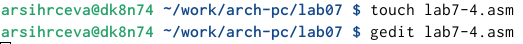

---
## Front matter
title: "Лабораторная работа №7"
subtitle: "Команды безусловного и условного переходов в Nasm. Программирование ветвлений."
author: "Сырцева Анастасия Романовна"

## Generic otions
lang: ru-RU
toc-title: "Содержание"

## Bibliography
bibliography: bib/cite.bib
csl: pandoc/csl/gost-r-7-0-5-2008-numeric.csl

## Pdf output format
toc: true # Table of contents
toc-depth: 2
lof: true # List of figures
fontsize: 12pt
linestretch: 1.5
papersize: a4
documentclass: scrreprt
## I18n polyglossia
polyglossia-lang:
  name: russian
  options:
	- spelling=modern
	- babelshorthands=true
polyglossia-otherlangs:
  name: english
## I18n babel
babel-lang: russian
babel-otherlangs: english
## Fonts
mainfont: IBM Plex Serif
romanfont: IBM Plex Serif
sansfont: IBM Plex Sans
monofont: IBM Plex Mono
mathfont: STIX Two Math
mainfontoptions: Ligatures=Common,Ligatures=TeX,Scale=0.94
romanfontoptions: Ligatures=Common,Ligatures=TeX,Scale=0.94
sansfontoptions: Ligatures=Common,Ligatures=TeX,Scale=MatchLowercase,Scale=0.94
monofontoptions: Scale=MatchLowercase,Scale=0.94,FakeStretch=0.9
mathfontoptions:
## Biblatex
biblatex: true
biblio-style: "gost-numeric"
biblatexoptions:
  - parentracker=true
  - backend=biber
  - hyperref=auto
  - language=auto
  - autolang=other*
  - citestyle=gost-numeric
## Pandoc-crossref LaTeX customization
figureTitle: "Рис."
tableTitle: "Таблица"
listingTitle: "Листинг"
lofTitle: "Список иллюстраций"
lolTitle: "Листинги"
## Misc options
indent: true
header-includes:
  - \usepackage{indentfirst}
  - \usepackage{float} # keep figures where there are in the text
  - \floatplacement{figure}{H} # keep figures where there are in the text
---

# Цель работы

Целью данной работы является изучение команд перезодов, а также приобритение навыков написания программ с использованием переходов. Знакомство с назначением и структурой файла листинга.

# Задание

- Работа с командами переходов;
- Знакомство с назначением и структурой файла листинга;

# Теоретическое введение

## Команды условного и безусловного перехода

Для реализации ветвлений в ассемблере используются так называемые команды передачи управления или команды перехода. Можно выделить 2 типа переходов:

- условный переход – выполнение или не выполнение перехода в определенную точку программы в зависимости от проверки условия.
- безусловный переход – выполнение передачи управления в определенную точку программы без каких-либо условий.

Безусловный переход выполняется инструкцией jmp (от англ. jump – прыжок), которая включает в себя адрес перехода, куда следует передать управление.

Для условного перехода необходима проверка какого-либо условия. В ассемблере команды условного перехода вычисляют условие перехода анализируя флаги из регистра флагов.

Флаг – это бит, принимающий значение 1 («флаг установлен»), если выполнено некоторое условие, и значение 0 («флаг сброшен») в противном случае. Флаги работают независимо друг от друга, и лишь для удобства они помещены в единый регистр — регистр флагов, отражающий текущее состояние процессора. В следующей таблице указано положение битовых флагов в регистре флагов (рис. [-@fig:000]).

{#fig:000 width=70%}

Инструкция cmp является одной из инструкций, которая позволяет сравнить операнды и выставляет флаги в зависимости от результата сравнения. Инструкция cmp является командой сравнения двух операндов и имеет такой же формат, как и команда вычитании.

Команда cmp, так же как и команда вычитания, выполняет вычитание, но результат вычитания никуда не записывается и единственным результатом команды сравнения является формирование флагов.

Мнемоника условного перехода связана со значением анализируемых флагов или со способом формирования этих флагов.

В табл. [-@tbl:7.1] представлены команды условного перехода, которые обычно ставятся после команды сравнения cmp. В их мнемокодах указывается тот результат сравнения, при котором надо делать переход.

: Инструкции условной передачи управления по результатам арифметического сравнения cmp a,b {#tbl:7.1}

| Типы операндов | Мнемокод | Критерий условного перехода | Комментарий |
|----------------|----------|-----------------------------|-------------|
| Любые | JE | a = b | Переход, если равно |
| Любые | JNE | a ≠ b | Переход, если не равно |
| Со знаком | JL/JNGE | a < b | Переход, если меньше |
| Со знаком | JLE/JNG | a ≤ b | Переход, если меньше или равно |
| Со знаком | JG/JNLE | a > b | Переход, если больше |
| Со знаком | JGE/JNL | a ≥ b | Переход, если больше или равно |
| Без знака | JB/JNAE | a < b | Переход, если ниже |
| Без знака | JBE/JNA | a ≤ b | Переход, если ниже или равно |
| Без знака | JA/JNBE | a > b | Переход, если выше |
| Без знака | JAE/JNB | a ≥ b | Переход, если выше или равно |

## Файл листинга и его структура

Листинг (в рамках понятийного аппарата NASM) — это один из выходных файлов, создаваемых транслятором. Он имеет текстовый вид и нужен при отладке программы, так как кроме строк самой программы он содержит дополнительную информацию.

Строки листинга имеют следующую структуру:

- Номер строки — это номер строки файла листинга (нужно помнить, что номер строки в файле листинга может не соответствовать номеру строки в файле с исходным текстом программы);
- Арес — это смещение машинного кода от начала текущего сегмента;
- Машинный код - ассемблированная исходная строка в виде шестнадцатеричной последовательности.
- Исходный текст программы - это просто строка исходной программы вместе с комментариями (некоторые строки на языке ассемблера, например, строки, содержащие только комментарии, не генерируют никакого машинного кода, и поля «смещение» и «исходный текст программы» в таких строках отсутствуют, однако номер строки им присваивается).

Все ошибки и предупреждения, обнаруженные при ассемблировании, транслятор выводит на экран, и файл листинга не создаётся.

# Выполнение лабораторной работы

Создаю папку для данной лабораторной работы, переходу в неё и создаю файл lab7-1.asm (рис. [-@fig:001]).

{#fig:001 width=70%}

Открываю файл и ввожу в файл текст программы с использованием новой инструкции, jmp(рис. [-@fig:002]).

{#fig:002 width=70%}

Копирую файл in_out.asm для корректной работы программы (рис. [-@fig:003]).

{#fig:003 width=70%}

Создаю и запускаю исполняемый файл(рис. [-@fig:004]).

{#fig:004 width=70%}

Результат работы программы совпадает с тем, что дано в условии лабораторной работы(рис. [-@fig:005]).

{#fig:005 width=70%}

Таким образом, использование инструкции jmp _label2 меняет порядок исполнения инструкций и позволяет выполнить инструкции начиная с метки _label2, пропустив вывод первого сообщения.

Изменяю программу таким образом, чтобы она выводила сначала 'Сообщение № 2', потом 'Сообщение № 1' и завершала работу.(рис. [-@fig:006]).

{#fig:006 width=70%}

Создаю и запускаю исполняемый файл(рис. [-@fig:007]).

{#fig:007 width=70%}

Результат удовлетворяет условию. Сначала выводится 'Сообщение № 2', потом 'Сообщение № 1', затем работа завершается.

Изменяю текст программы, используя jmp, таким образом, чтобы сообщения выводились в следующем порядке: 'Сообщение №3', 'Сообщение № 2', 'Сообщение № 1', (рис. [-@fig:008]).

{#fig:008 width=70%}

Создаю исполняемый файл и запускаю его(рис. [-@fig:009]).

{#fig:009 width=70%}

Создаю файл lab7-2.asm и открываю его для редактирования(рис. [-@fig:010]).

{#fig:010 width=70%}

Ввожу текст программы, которая выводит наибольшее из трёх чисел(рис. [-@fig:011]).

{#fig:011 width=70%}

Создаю и несколько раз запускаю исполняемый файл. На запрос программы ввожу различные числа(рис. [-@fig:012]).

{#fig:012 width=70%}

Создаю файл листинга для программы из файла lab7-2.asm(рис. [-@fig:013]).

{#fig:013 width=70%}

Открываю файл листинг в редакторе gedit(рис. [-@fig:014]).

{#fig:014 width=70%}

Внимательно изучаю текст программы.

Подробно разбираю строку под номером 197 (рис. [-@fig:015]).

- '22' - номер данной строки в исходном файле ;
- '00000106' - адрес строки;
- 'E891FFFFFF' - машинный код;
- 'call atoi' - вызов подпрограммы перевода символа в число из исходного файла

{#fig:015 width=70%}

Также разберу строку под номером 213(рис. [-@fig:016]).

- '38' - номер данной строки в исходном файле ;
- '00000145' - адрес строки;
- '3B0D[0A000000]' - машинный код;
- 'cmp ecx,[B] ; Сравниваем 'max(A,C)' и 'B'' - строка из исходного файла, где 'cmp ecx,[B]' - команда для сравнения операнд ecx и [B], а '; Сравниваем 'max(A,C)' и 'B'' - комментарий

{#fig:016 width=70%}

Делаю то же самое для строки 220(рис. [-@fig:017]).

- '45' - номер данной строки в исходном файле ;
- '0000015E' - адрес строки;
- 'E8ACFEFFFF' - машинный код;
- 'call sprint'' - строка из исходного файла, вывод сообщения 'Наибольшее число: '

{#fig:017 width=70%}

Открываю файл lab7-2.asm и в строке 35 удаляю операнд eax(рис. [-@fig:018]).

{#fig:018 width=70%}

Создаю файл листинга(рис. [-@fig:019]).

{#fig:019 width=70%}

Выдаётся ошибка: invalid combination of opcode and operands.

Открываю файл lab7-2.lst(рис. [-@fig:020]).

{#fig:020 width=70%}

В файле показано конкретное место, где есть ошибка(35 строка) и указано название ошибки(invalid combination of opcode and operands)

# Самостоятельная работа

## Первое задание

Создаю и открываю для редактирования файл lab7-3.asm(рис. [-@fig:021]).

{#fig:021 width=70%}

Пишу текст программы для нахождения наименьшей из 3 целочисленных переменных a, b и c.(рис. [-@fig:022]).

{#fig:022 width=70%}

Нахожу номер варианта, соответствующий варианту из лабораторной №6. А именно первый вариант (рис. [-@fig:023]).

{#fig:023 width=70%}

Создаю и запускаю исполняемый файл. На запросы программы ввожу числа из 1 варианта (рис. [-@fig:024]).

{#fig:024 width=70%}

В ответе выводится число 17, наименьшее из трех введённых.

## Второе задание

Создаю и открываю в текстовом редакторе файл lab7-4 (рис. [-@fig:025]).

{#fig:025 width=70%}

Нахожу 1 вариант для выполнения задания (рис. [-@fig:026]).

{#fig:026 width=70%}

Ввожу текст программы, которая будет вычислять значение функции f для введённых переменных a и x(рис. [-@fig:027]).

{#fig:027 width=70%}

Создаю и запускаю исполняемый файл. На запрос программы ввожу значения x=1, a=2(рис. [-@fig:028]).

{#fig:028 width=70%}

Запускаю файл ещё раз и ввожу новые значения переменных(рис. [-@fig:029]).

{#fig:029 width=70%}

# Выводы

Изучены команды условного и безусловного переходов. Получены навыки написания программ с использованием переходов. Также изучена структура и назначение файла листига.

