---
## Front matter
title: "Лабораторная работа №8"
subtitle: "Простейший вариант"
author: "Сырцева Анастасия Романовна"

## Generic otions
lang: ru-RU
toc-title: "Содержание"

## Bibliography
bibliography: bib/cite.bib
csl: pandoc/csl/gost-r-7-0-5-2008-numeric.csl

## Pdf output format
toc: true # Table of contents
toc-depth: 2
lof: true # List of figures
lot: true # List of tables
fontsize: 12pt
linestretch: 1.5
papersize: a4
documentclass: scrreprt
## I18n polyglossia
polyglossia-lang:
  name: russian
  options:
	- spelling=modern
	- babelshorthands=true
polyglossia-otherlangs:
  name: english
## I18n babel
babel-lang: russian
babel-otherlangs: english
## Fonts
mainfont: IBM Plex Serif
romanfont: IBM Plex Serif
sansfont: IBM Plex Sans
monofont: IBM Plex Mono
mathfont: STIX Two Math
mainfontoptions: Ligatures=Common,Ligatures=TeX,Scale=0.94
romanfontoptions: Ligatures=Common,Ligatures=TeX,Scale=0.94
sansfontoptions: Ligatures=Common,Ligatures=TeX,Scale=MatchLowercase,Scale=0.94
monofontoptions: Scale=MatchLowercase,Scale=0.94,FakeStretch=0.9
mathfontoptions:
## Biblatex
biblatex: true
biblio-style: "gost-numeric"
biblatexoptions:
  - parentracker=true
  - backend=biber
  - hyperref=auto
  - language=auto
  - autolang=other*
  - citestyle=gost-numeric
## Pandoc-crossref LaTeX customization
figureTitle: "Рис."
tableTitle: "Таблица"
listingTitle: "Листинг"
lofTitle: "Список иллюстраций"
lotTitle: "Список таблиц"
lolTitle: "Листинги"
## Misc options
indent: true
header-includes:
  - \usepackage{indentfirst}
  - \usepackage{float} # keep figures where there are in the text
  - \floatplacement{figure}{H} # keep figures where there are in the text
---

# Цель работы

Целью данной работы является приобретение навыков написания программ с использованием циклов и обработкой аргументов командной строки.

# Задание

- Изучение программы с использованием циклов
- Знакомство с использованием аргументов командной строки
- Обработка аргуметов командной строки

# Теоретическое введение

Стек — это структура данных, организованная по принципу LIFO («Last In — First Out» или «последним пришёл — первым ушёл»). Стек является частью архитектуры процессора и реализован на аппаратном уровне. Для работы со стеком в процессоре есть специальные регистры (ss, bp, sp) и команды.
Основной функцией стека является функция сохранения адресов возврата и передачи аргументов при вызове процедур. Кроме того, в нём выделяется память для локальных переменных и могут временно храниться значения регистров.
Стек имеет вершину, адрес последнего добавленного элемента, который хранится в ре- гистре esp (указатель стека). Противоположный конец стека называется дном. Значение, помещённое в стек последним, извлекается первым. При помещении значения в стек указатель стека уменьшается, а при извлечении — увеличивается.
Для стека существует две основные операции:
- добавление элемента в вершину стека (push);
- извлечение элемента из вершины стека (pop).
Команда push размещает значение в стеке, т.е. помещает значение в ячейку памяти, на которую указывает регистр esp, после этого значение регистра esp увеличивается на 4.
Данная команда имеет один операнд — значение, которое необходимо поместить в стек.
Команда pop извлекает значение из стека, т.е. извлекает значение из ячейки памяти, на которую указывает регистр esp, после этого уменьшает значение регистра esp на 4. У этой команды также один операнд, который может быть регистром или переменной в памяти.
Извлечённый из стека элемент не стирается из памяти, а будет перезаписан при записи нового значения в стек.

# Выполнение лабораторной работы

Создаю рабочую папку для лабораторной работы №8, перехожу в неё и создаю файл lab8-1.asm(рис. [-@fig:001]).

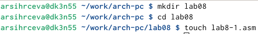{#fig:001 width=70%}

Внимательно изучаю листинг программы вывода значений регистра ecx. Для корректной работы копирую внешний файл in_out.asm в рабочий каталог(рис. [-@fig:002]).

{#fig:002 width=70%}

Открываю файл и ввожу текст упомянутой программы(рис. [-@fig:003]).

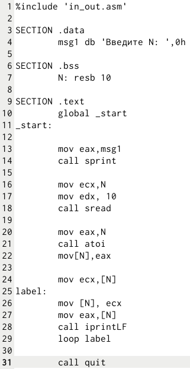{#fig:003 width=70%}

Создаю исполняемый файл(рис. [-@fig:004]).

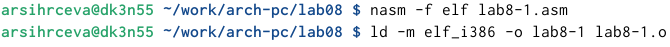{#fig:004 width=70%}

Проверяю результат работы программы(рис. [-@fig:005]).

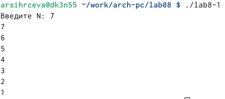{#fig:005 width=70%}

Изменяю текст программы, добавив изменение значения регистра ecx в цикле(рис. [-@fig:006]).

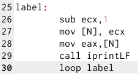{#fig:006 width=70%}

Создаю и запускаю исполняемый файл. В результате получается бесконечный цикл(рис. [-@fig:007]).

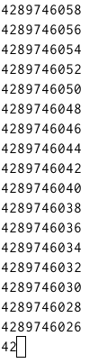{#fig:007 width=70%}

Вношу изменения в текст программы, добавив команды push и pop для сохранения значения счетчика цикла loop(рис. [-@fig:008]).

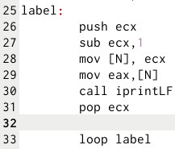{#fig:008 width=70%}

Создаю исполняемый файл изменённой программы(рис. [-@fig:009]).

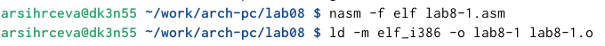{#fig:009 width=70%}

Запускаю его и проверяю работу(рис. [-@fig:010]).

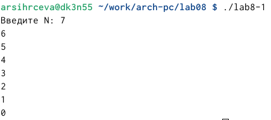{#fig:010 width=70%}

В данном случае число проходов цикла соответствует значению, введённому с клавиатуры.
Создаю файл lab8-2.asm(рис. [-@fig:011]).

{#fig:011 width=70%}

Внимательно изучаю текст программы из условия лабораторной работы. Открываю созданный файл для редактирования и ввожу текст программы, выводящей на экран аргументы командной строки(рис. [-@fig:012]).

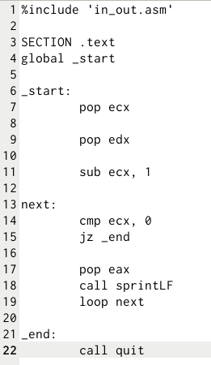{#fig:012 width=70%}

Создаю исполняемый файл. При его запуске указываю аргументы: аргумент1 аргумент 2 'аргумент 3'(рис. [-@fig:013]).

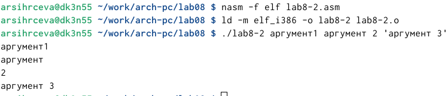{#fig:013 width=70%}

Команда обработала 4 аргумента. "аргумент" и "2" считаются разными аргументами, так как между ними стоит пробел.
Создаю файл lab8-3.asm для следующей программы(рис. [-@fig:014]).

{#fig:014 width=70%}

В созданный файл ввожу текст программы для вычисления суммы аргументов командной строки(рис. [-@fig:015]).

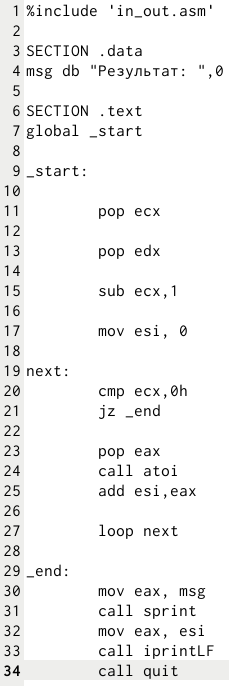{#fig:015 width=70%}

Создаю и запускаю исполняемый файл. При запуске указываю аргументы: 12, 13, 7, 10, 5(рис. [-@fig:016]).

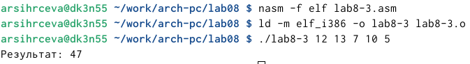{#fig:016 width=70%}

12+13+7+10+5=47. Это совпадает с результатом программы, следовательно она работает правильно.
Изменяю текст программы в файле lab8-3.asm так, чтобы программы вычисляла произведение аргументов командной строки(рис. [-@fig:017]).

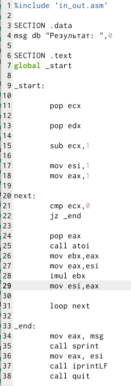{#fig:017 width=70%}

Создаю исполняемый файл. При его запуске указываю некоторые аргументы(рис. [-@fig:018]), запускаю ещё раз с другими аргументами для проверки(рис. [-@fig:019]).

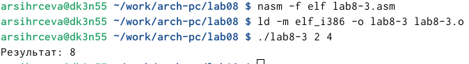{#fig:018 width=70%}

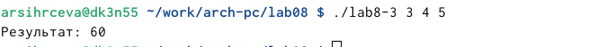{#fig:019 width=70%}

# Самостоятельная работа

Создаю файл lab8-4.asm для выполнения самостоятельной работы(рис. [-@fig:020]).

{#fig:020 width=70%}

Нахожу свой вариант из 7 лабораторной работы. Это вариант 1(рис. [-@fig:021]).

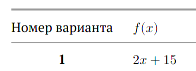{#fig:021 width=70%}

Открываю файл и ввожу текст программы для вычисления суммы функций вида f(x)=2x+15, где x -  аргументы командной строки(рис. [-@fig:022]).

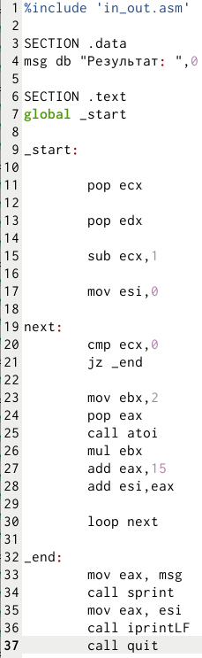{#fig:022 width=70%}

Создаю и запускаю исполняемый файл. При запуске указываю некоторые аргументы. Для проверки запускаю программу ещё раз и ввожу новые аргументы(рис. [-@fig:023]).

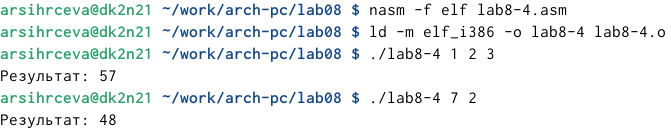{#fig:023 width=70%}

# Выводы

Приобретены навыки написания программ с использованием циклов и обработкой аргументов командной строки.

