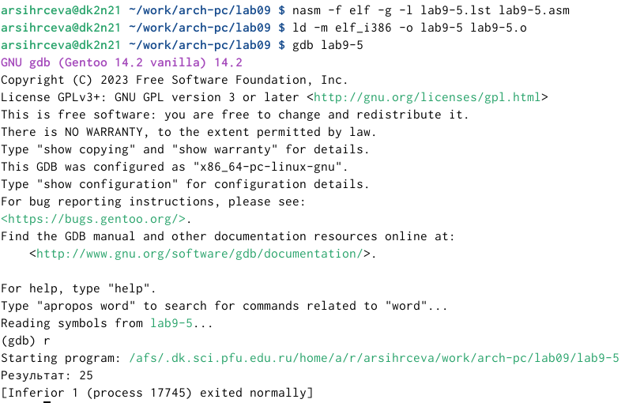

---
## Front matter
title: "Лабораторная работа №9"
subtitle: "Понятие подпрограммы. Отладчик GDB"
author: "Сырцева Анастасия Романовна"

## Generic otions
lang: ru-RU
toc-title: "Содержание"

## Bibliography
bibliography: bib/cite.bib
csl: pandoc/csl/gost-r-7-0-5-2008-numeric.csl

## Pdf output format
toc: true # Table of contents
toc-depth: 2
lof: true # List of figures
fontsize: 12pt
linestretch: 1.5
papersize: a4
documentclass: scrreprt
## I18n polyglossia
polyglossia-lang:
  name: russian
  options:
	- spelling=modern
	- babelshorthands=true
polyglossia-otherlangs:
  name: english
## I18n babel
babel-lang: russian
babel-otherlangs: english
## Fonts
mainfont: IBM Plex Serif
romanfont: IBM Plex Serif
sansfont: IBM Plex Sans
monofont: IBM Plex Mono
mathfont: STIX Two Math
mainfontoptions: Ligatures=Common,Ligatures=TeX,Scale=0.94
romanfontoptions: Ligatures=Common,Ligatures=TeX,Scale=0.94
sansfontoptions: Ligatures=Common,Ligatures=TeX,Scale=MatchLowercase,Scale=0.94
monofontoptions: Scale=MatchLowercase,Scale=0.94,FakeStretch=0.9
mathfontoptions:
## Biblatex
biblatex: true
biblio-style: "gost-numeric"
biblatexoptions:
  - parentracker=true
  - backend=biber
  - hyperref=auto
  - language=auto
  - autolang=other*
  - citestyle=gost-numeric
## Pandoc-crossref LaTeX customization
figureTitle: "Рис."
tableTitle: "Таблица"
listingTitle: "Листинг"
lofTitle: "Список иллюстраций"
lolTitle: "Листинги"
## Misc options
indent: true
header-includes:
  - \usepackage{indentfirst}
  - \usepackage{float} # keep figures where there are in the text
  - \floatplacement{figure}{H} # keep figures where there are in the text
---

# Цель работы

Целью данной работы является приобретение навыков написания программ с использованием подпрограмм. Знакомство с методами отладки при помощи GDB и его основными возможностями.

# Задание

- Ознакомление с подпрограммами
- Изучение отладки при помощи GDB

# Выполнение лабораторной работы

Создаю папку для данной лабораторной работы. Перехожу в неё и создаю lab9-1.asm(рис. [-@fig:001]).

{#fig:001 width=70%}

Внимательно изучаю листинг программы с использованием вызова подпрограммы. Для корректной работы необходим внешний файл in_out.asm. Копирую его в рабочую папку(рис. [-@fig:002]).

{#fig:002 width=70%}

Ввожу в файл lab9-1.asm текст данной программы(рис. [-@fig:003]).

{#fig:003 width=70%}

Создаю и запускаю исполняемый файл. Проверяю работу программы(рис. [-@fig:004]).

{#fig:004 width=70%}

Изменяю программу так, чтобы исходная функция была зависима от другой функции. Для этого добавляю ещё одну подпрограмму в исходную подпрограмму(рис. [-@fig:005]).

{#fig:005 width=70%}

Создаю и запускаю исполняемый файл изменённой программы(рис. [-@fig:006]).

{#fig:006 width=70%}

Создаю новый файл lab9-2.asm( (рис. [-@fig:007]).

{#fig:007 width=70%}

Ввожу в файл текст программы вывода сообщения Hello world!(рис. [-@fig:008]).

{#fig:008 width=70%}

Создаю исполняемый файл для работы с GDB(рис. [-@fig:009]).

{#fig:009 width=70%}

Загружаю исполняемый файл в отладчик GDB(рис. [-@fig:010]).

{#fig:010 width=70%}

Проверяю работу программы, запустив её в оболочке GDB с помощью команды r(рис. [-@fig:011]).

{#fig:011 width=70%}

Для более подробного анализа программы устанавливаю брейкпоинт на метку _start, с которой начинается выполнение программы. Запускаю её(рис. [-@fig:012]).

{#fig:012 width=70%}

С помощью команды disassemble _start  изучаю дисассимилированный код программы(рис. [-@fig:013]).

{#fig:013 width=70%}

Переключаюсь на отображение команд с intel’овским синтаксисом(рис. [-@fig:014]).

{#fig:014 width=70%}

В дисассимилированном отображении используютя символы % и $ в командах, intel’овское же отображении они отсутствуют.
Для удобства включаю режим псевдографики для более удобного анализа программы(рис. [-@fig:015]).

{#fig:015 width=70%}

Проверяю наличие метки _start(рис. [-@fig:016]).

{#fig:016 width=70%}

Вручную ищу последнюю команду кода и смотрю её адрес(рис. [-@fig:017]).

{#fig:017 width=70%}

Устанавливаю очку останова данной строчке(рис. [-@fig:018]).навыков написания программ с использованием подпрограмм. Знакомство с методами отладки при помощи GDB и его основными возможностями.

{#fig:018 width=70%}

Ещё раз просматриваю информацию о брейкпоинтах(рис. [-@fig:019]).

{#fig:019 width=70%}

Выполняю команду stepi, изучаю значение регистров(рис. [-@fig:020]).

{#fig:020 width=70%}

Пять раз выполняю инструкции с помощью данной команды(рис. [-@fig:021]).

{#fig:021 width=70%}

Изучаю изменения значений регистров. Они поменялись у регистров eax, ecx, edx, ebx, eip(рис. [-@fig:022]).

{#fig:022 width=70%}

Просматриваю значение переменной msg1 по имени(рис. [-@fig:023]).

{#fig:023 width=70%}

Вручную ищу адрес msg2(рис. [-@fig:024]).

{#fig:024 width=70%}

Просматриваю значение переменной msg2 по адрессу(рис. [-@fig:025]).

{#fig:025 width=70%}

Изменяю первый символ переменной msg1. Проверяю(рис. [-@fig:026]).

{#fig:026 width=70%}

Также изменяю первый символ переменной msg2. Проверяю(рис. [-@fig:027]).

{#fig:027 width=70%}

Вывожу значение регистра edx в шестнадцатиричном формате(рис. [-@fig:028]), в двоичном формате (рис. [-@fig:029]), в символьном виде(рис. [-@fig:030]).

{#fig:028 width=70%}

{#fig:029 width=70%}

{#fig:030 width=70%}

Изменяю значение регистра ebx с помощью команды set(рис. [-@fig:031]).

{#fig:031 width=70%}

Выводятся разные значения, так как в первый раз мы вносим значение 2, а во второй - регистр приравниваем к 2.
Завершаю выполнение программы и выхожу из GDB.
Копирую файл lab8-2.asm, созданный при выполнении лабораторной работы №8, изменяю его название на lab9-3.asm(рис. [-@fig:032]).

{#fig:032 width=70%}

Создаю исполняемый файл. При запуске указываю ключ --args и аргументы(рис. [-@fig:033]).

{#fig:033 width=70%}

Устонавливаю точку останова перед первой иструкцией(рис. [-@fig:034]).

{#fig:034 width=70%}

Заускаю программу(рис. [-@fig:035]).

{#fig:035 width=70%}

проверяю адрес вершины стека(рис. [-@fig:036]).

{#fig:036 width=70%}

Убеждаюсь, что в нем хранится 5 аргументов
Просматриваю остальные позиции стека(рис. [-@fig:037]), (рис. [-@fig:038]), (рис. [-@fig:039]), (рис. [-@fig:040]), (рис. [-@fig:041]), (рис. [-@fig:042]).

{#fig:037 width=70%}

{#fig:038 width=70%}

{#fig:039 width=70%}

{#fig:040 width=70%}

{#fig:041 width=70%}

{#fig:042 width=70%}

Шаг изменения адреса равен 4, так как стех хранит до 4 байт. Также компьютер использует новый стек для нормального сохранения данных.

#Самостоятельная работа

## Задание 1

Копирую файл с самостоятельной работой из лабораторной работы №8 и переименовываю его. Изменяю текст программы так, чтобы значение функции вычислялось как подпрограмма(рис. [-@fig:043]).

{#fig:043 width=70%}

Создаю и запускаю исполняемый файл. Проверяю его работу(рис. [-@fig:044]).

{#fig:044 width=70%}

## Задание 2

Создаю новый файл для самостоятельной работы(рис. [-@fig:045]).

{#fig:045 width=70%}

Ввожу текст программы для вычисления выражения(рис. [-@fig:046]).

{#fig:046 width=70%}

Создаю и запускаю исполняемый файл, чтобы проверить его работу(рис. [-@fig:047]).

{#fig:047 width=70%}

Программа выводит неверный ответ. Вместо 25 - 10
Для поиска ошибки воспользуюсь отладчиком GDB. Загружаю исполняемый файл в данный отладчик, устанавливаю точку останова и запускаю программу(рис. [-@fig:048]).

{#fig:048 width=70%}

Включаю режим псевдографики, просматриваю значение регистров(рис. [-@fig:049]).

{#fig:049 width=70%}

Пошагово выполняю инструкции с помощью команды steri. Нахожу ошибку в неправильном порядке операнд. Исправляю это.
Создаю и запускаю исполняемый файл. Проверяю его работу(рис. [-@fig:050]).

{#fig:050 width=70%}

# Выводы

Приобретены навыки написания программ с использованием подпрограмм. Я ознакомилась с методами отладки при помощи GDB и его основными возможностями.

