---
## Front matter
title: "Лабораторная работы №10"
subtitle: "Работа с файлами средствами Nasm"
author: "Сырцева Анастасия Романовна"

## Generic otions
lang: ru-RU
toc-title: "Содержание"

## Bibliography
bibliography: bib/cite.bib
csl: pandoc/csl/gost-r-7-0-5-2008-numeric.csl

## Pdf output format
toc: true # Table of contents
toc-depth: 2
lof: true # List of figures
lot: true # List of tables
fontsize: 12pt
linestretch: 1.5
papersize: a4
documentclass: scrreprt
## I18n polyglossia
polyglossia-lang:
  name: russian
  options:
	- spelling=modern
	- babelshorthands=true
polyglossia-otherlangs:
  name: english
## I18n babel
babel-lang: russian
babel-otherlangs: english
## Fonts
mainfont: IBM Plex Serif
romanfont: IBM Plex Serif
sansfont: IBM Plex Sans
monofont: IBM Plex Mono
mathfont: STIX Two Math
mainfontoptions: Ligatures=Common,Ligatures=TeX,Scale=0.94
romanfontoptions: Ligatures=Common,Ligatures=TeX,Scale=0.94
sansfontoptions: Ligatures=Common,Ligatures=TeX,Scale=MatchLowercase,Scale=0.94
monofontoptions: Scale=MatchLowercase,Scale=0.94,FakeStretch=0.9
mathfontoptions:
## Biblatex
biblatex: true
biblio-style: "gost-numeric"
biblatexoptions:
  - parentracker=true
  - backend=biber
  - hyperref=auto
  - language=auto
  - autolang=other*
  - citestyle=gost-numeric
## Pandoc-crossref LaTeX customization
figureTitle: "Рис."
tableTitle: "Таблица"
listingTitle: "Листинг"
lofTitle: "Список иллюстраций"
lotTitle: "Список таблиц"
lolTitle: "Листинги"
## Misc options
indent: true
header-includes:
  - \usepackage{indentfirst}
  - \usepackage{float} # keep figures where there are in the text
  - \floatplacement{figure}{H} # keep figures where there are in the text
---

# Цель работы

Целью лабораторной работы является приобретение навыков написания программ для работы с файлами.

# Задание

- Ввести в файл lab10-1.asm текст программы  записи в файл сообщения, проверить его работу;
- Изменить права доступа к исполняемому файлу lab10-1,запретив его выполнение;
- С помощью команды chmod измените права доступа к файлу lab10-1.asm с исходным текстом программы, добавив права на исполнение;
- В соответствии с вариантом из лабораторной №7 предоставить права доступа к файлу readme-1.txt представленные в символьном виде, а для файла readme-2.txt – в двочном виде.

# Теоретическое введение

ОС GNU/Linux является многопользовательской операционной системой. И для обеспече-ния защиты данных одного пользователя от действий других пользователей существуют специальные механизмы разграничения доступа к файлам. Кроме ограничения доступа, дан-ный механизм позволяет разрешить другим пользователям доступ данным для совместной работы.
Права доступа определяют набор действий (чтение, запись, выполнение), разрешённых для выполнения пользователям системы над файлами. Для каждого файла пользователь может входить в одну из трех групп: владелец, член группы владельца, все остальные. Для каждой из этих групп может быть установлен свой набор прав доступа. Владельцем файла является его создатель. 
Набор прав доступа задается тройками битов и состоит из прав на чтение, запись и исполнение файла. В символьном представлении он имеет вид строк rwx, где вместо любого символа может стоять дефис. Всего возможно 8 комбинаций, приведенных в таблице [-@tbl:10.01]. Буква означает наличие права, а дефис означает отсутствие права. Также права доступа могут быть представлены как восьмеричное число.

: Двоичный, буквенный и восмеричный способ записи триады прав доступа {#tbl:10.01}

| Двоичный | Буквенный     |  Восьмеричный                        |
|--------------|-------------------------------------------------|-----------------------------------------------------|
| 111        | rwx                                 |                          7                   |
|  110      | rw- |   6 |
|  101      | r-x              |        5                |
|  100     | r-- |  4  |
| 011     | -wx                                                 |                 3              |
| 010    | -w- |                                        2                                          |
| 001      | --x      |                            1                        |
| 000      |---                          |                 0               |

Свойства (атрибуты) файлов и каталогов можно вывести на терминал с помощью команды
ls с ключом -l.
В первой колонке показаны текущие права доступа, далее указан владелец файла и группа(рис. [-@fig:000]):

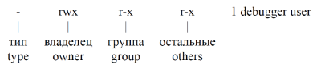{#fig:000 width=70%}

Тип файла определяется первой позицией, это может быть: каталог — d, обычный файл— дефис (-) или символьная ссылка на другой файл — l. Следующие 3 набора по 3 символа определяют конкретные права для конкретных групп: r — разрешено чтение файла, w — разрешена запись в файл; x — разрешено исполнение файл и дефис (-) — право не дано.
Для изменения прав доступа служит команда chmod, которая понимает как символьное, так и числовое указание прав.

озможные значения аргументов команды представлены в таблице [-@tbl:10.02].

: Возможные значения аргументов команды chmod {#tbl:10.02}

|Категория|Обозначение|Значение|
|---------|-----------|--------|
|Принадлежность|u|Владелец|
| |g|Группа владельца|
| |o|Прочие пользователи|
| |a|Все пользователи|
|Действие|+|Добавить набор прав|
| |-|Отменить набор прав|
| |=|назначить набор прав|
|Право|r|Право на чтение|
| |w|Право на запись|
| |x|Право на исполнение|

# Выполнение лабораторной работы

Создаю рабочий каталог и файлы в нём для выполнения данной лабораторной работы (рис. [-@fig:001]).

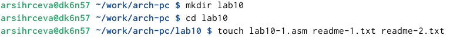{#fig:001 width=70%}

Ввожу в файл lab10-1.asm программу записи в файл сообщения(рис. [-@fig:002]).

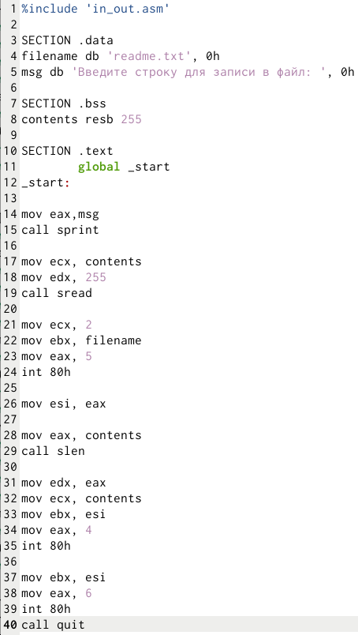{#fig:002 width=70%}

Для корректной работы программы копирую в рабочую папку внейшний файл in_out.asm(рис. [-@fig:003]).

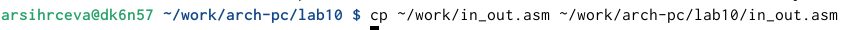{#fig:003 width=70%}

Создаю и запускаю исполняемый файл, проверяю его работу(рис. [-@fig:004]).

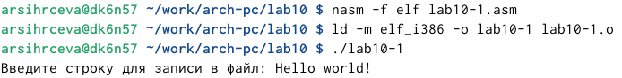{#fig:004 width=70%}

С помощью команды chmod запрещаю выполнение файла lab10-1(рис. [-@fig:005]).

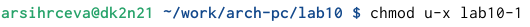{#fig:005 width=70%}

Запускаю файл с изменёнными правами доступа(рис. [-@fig:006]).

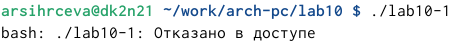{#fig:006 width=70%}

Выдаётся отказ, так как я запретила владельцу, себе, запуск файла.
Разрешаю запуск файла lab10-1.asm с помощью той же команды(рис. [-@fig:007]).

{#fig:007 width=70%}

Создаю и запускаю исполняемый файл(рис. [-@fig:008]).

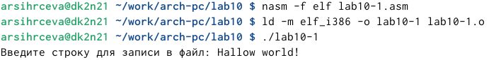{#fig:008 width=70%}

Программа запустилась, так как исполняемый файл был перекомпелирован и не имеет запретов.
Для выполнения задания нахожу свой вариант в соответствии с вариантом в лабораторной работе №7(рис. [-@fig:009]).

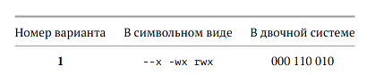{#fig:009 width=70%}

В соответствии с этим вариантов предоставляю права доступа в символьном виде к файлу readme-1.txt. Проверяю правильность с помощью команды  ls -l(рис. [-@fig:010]).

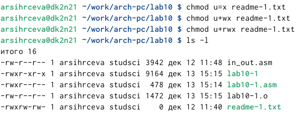{#fig:010 width=70%}

Также в соответствии с вариантом предоставляю права доступа в двоичном виде к файлу readme-2.txt(рис. [-@fig:011]), проверяю правильность выполнения команд(рис. [-@fig:012]).

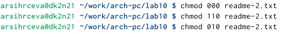{#fig:011 width=70%}

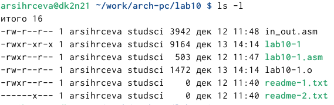{#fig:012 width=70%}

# Самостоятельная работа

Создаю файл lab10-1.asm для выполнения задания. Ввожу в него программу(рис. [-@fig:013]), которая будет работать по следующему алгоритму:
1. Вывод приглашения "Как Вас зовут?"
2. Ввод фамилии и имени с клавиатуры
3. создание файла name.txt
4. Запись в файл сообщения "Меня зовут"
5. Запись в файл строки, введённой с клавиатуры
6. Закрытие файла

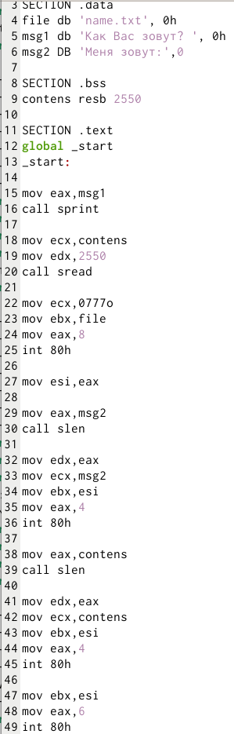{#fig:013 width=70%}

Создаю и запускаю исполняемый файл, на запрос программы ввожу свои фамилию и имя. С помщью команды ls -l проверяю правильность выполнения(рис. [-@fig:014]).

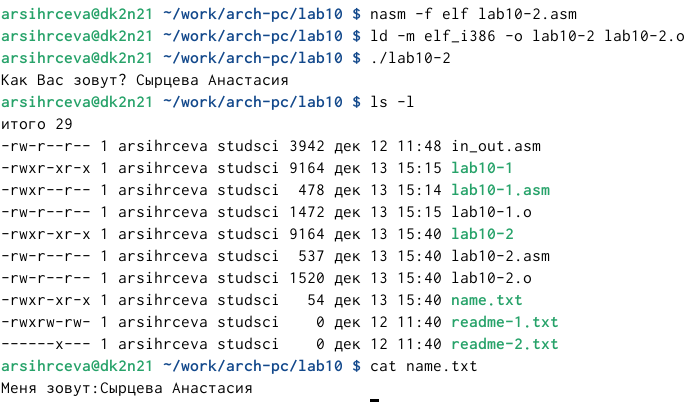{#fig:014 width=70%}

# Выводы

Приобретены навыки написания программ для работы с файлами.

